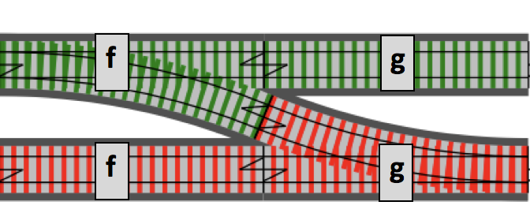

# Railway Oriented Programming

Railway Oriented Programming _(ROI)_ is a functional programming pattern that relies on the use of monads to have 
predictable _"tracks"_ and avoid as much as possible the use of exceptions.

## What's a monad?

A monad is a _"container"_ that:

* wraps a value
* has the `flatMap` operation

Well known examples of monads in ESM are `Mono<T>` and `Flux<t>`.

## Tracks

ROI is implemented by combining functions that return optional types _(disjoint unions)_. The return is usually binary 
and express the concept that the value can either exist or not. So, instead of:

```kotlin
fun divide(a: Double, b: Double): Double? =
  if (b == 0.0) { null } else { a / b }
```

you can write:

```kotlin
fun divide(a: Double, b: Double): Either<String, Double> =
  if (b == 0.0) { Either.left("Division by zero.") } else { Either.right(a / b) }
```

In the first implementation you have to check for `null` values to use the `divide` function, in the second one you can
just _"chain"_ the function with the next one. If the `divide` function _"succeeds"_, the next function in the chain will 
unwrap the `Double` and use it as an input. If `divide` fails, the next function in the chain will simply forward the 
`String` value to the end of the chain.



This model can be of course extended to chain many more function. When any of the functions in the chain fails, the 
computation is interrupted and the error, in our case a `String` will be forwarded to the end and can be used to take 
extra decisions or simply for debugging.


Some use cases for ROI are:

* ETLs
* validations
* reactive processors 🙂
* ...

## Example 1

_Divides C by the difference between A and B and add 1,000_

### Vanilla Kotlin

```kotlin
fun engineA(a: Int, b: Int, c: Int): Int =
    try {
        sum(1000, divide(c, subtract(a, b)))
    } catch (e: ArithmeticException) {
        42
    }

private fun subtract(a: Int, b: Int): Int = a - b

private fun divide(a: Int, b: Int): Int = a / b

private fun sum(a: Int, b: Int): Int = a + b
```

The engine has to rescue the `ArithmeticException` and return a flag value.

### ROI

```kotlin
fun engineB(a: Int, b: Int, c: Int): Int =
    subtract(a, b)
        .flatMap { divide(c, it) }
        .flatMap { sum(it, 1000) }
        .getOrElse(42)

private fun subtract(a: Int, b: Int): Either<String, Int> =
    Either.right(a - b)

private fun divide(a: Int, b: Int): Either<String, Int> =
    if (b != 0) Either.right(a / b) else Either.left("B is zero!")

private fun sum(a: Int, b: Int): Either<String, Int> =
    Either.right(a + b)
```

Functions are chained with no need for exceptions handling. The exceptions topic is controversial, but I find easier 
and cleaner to work without exceptions: functions are easier to reason about, tests are easier to implement, better 
performances, etc.

## Example 2

_"Network calls"_

### Vanilla Kotlin

```kotlin
fun clientA(url: String): Array<Stock>? =
    try {
        RestTemplate().getForObject(url, Array<Stock>::class.java)
    } catch (e: ResourceAccessException) {
        println("Something went wrong: $e) }")
        null
    }
```

Function can either return `null`, and we have to check for it, or an empty array, and we need to know what it means,
or throw another exception. Also, we need to check the logs to figure out what happened.

### ROI

```kotlin
fun clientB(url: String): Either<Throwable, Array<Stock>?> =
    Try
        .of { RestTemplate().getForObject(url, Array<Stock>::class.java) }
        .toEither()
```

When we combine this function with other the computation is halted and the error message propagated. 

## Example 3

_"Compute the sum of stocks that have been fetched from a remote provider"_

### Vanilla Kotlin

```kotlin
fun connectedEngineA(url: String): Double? =
    clientA(url)?.sumByDouble { it.price }
```

### ROI

```kotlin
fun connectedEngineB(url: String): Double? =
    clientB(url)
        .flatMap { sum(it) }
        .getOrElse(0.0)

private fun sum(l: Array<Stock>?): Either<Throwable, Double> =
    Either.right(l?.sumByDouble { it.price })
```

In this case vanilla Kotlin feels cleaner than the ROI version, but `clientA` internally has a `try / catch` and it 
logs _(side effect)_.
